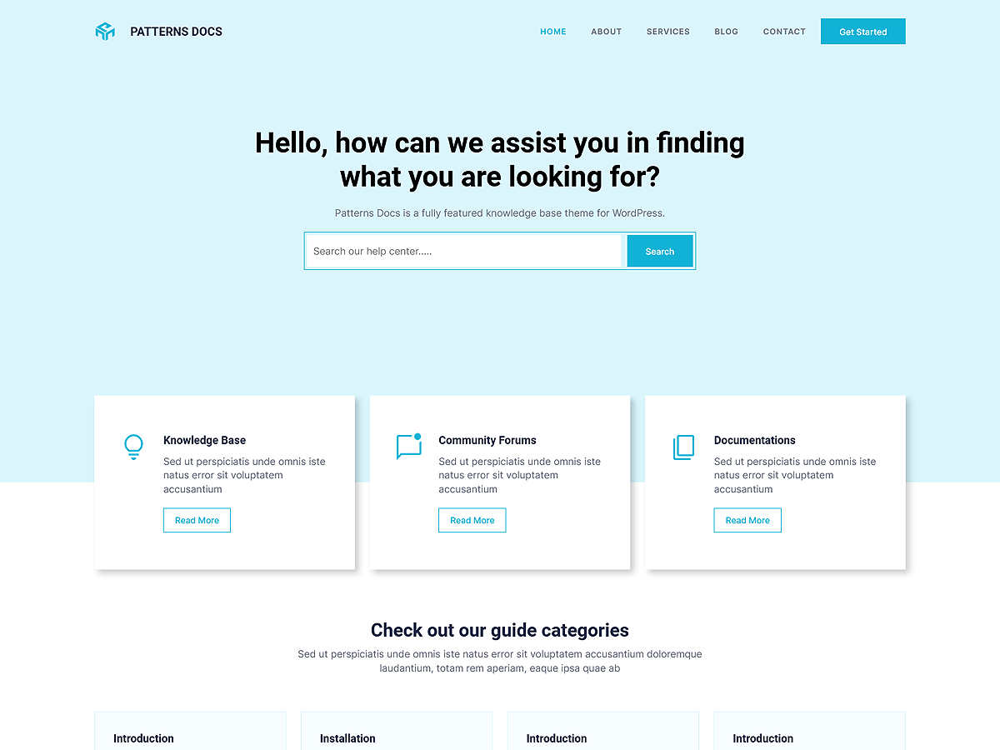

# Patterns Docs

Patterns Docs is a clean and professional WordPress theme designed for documentation websites, knowledge bases, wikis, and help centers. Built with WordPress Full Site Editing (FSE), this theme allows effortless customization of headers, footers, templates, and global styles directly within the WordPress Site Editor. The theme includes pre-designed patterns and layouts crafted for organizing guides, FAQs, and support articles. Its responsive design ensures that your documentation remains well-structured, user-friendly, and accessible across all devices.

Primary color: `#10b3d6`.



## Features

- 1 hero/landing pattern (landing)
- 2 card layouts (card-1 through card-2)
- 1 FAQ pattern
- 5 archive/post-listing patterns
- 2 contact page patterns
- 1 menu navigation pattern
- 8 documentation-specific patterns (docs archive left sidebar, docs sidebar, hidden single docs content, post navigation docs)
- 7 section layout patterns (featured sections and section titles)
- Full Site Editing (FSE) support
- Responsive design
- 62 block patterns + 20 templates + 13 template parts
- Documentation and knowledge-base oriented layouts

## Requirements

- WordPress 6.6 or higher
- PHP 7.0 or higher
- Tested up to WordPress 6.7

## Development

This theme uses `@wordpress/scripts`:

```sh
npm install
npm run start    # dev mode with watch
npm run build    # production build
```

## License

GNU General Public License v2 or later.

This theme is based on [WP Block Theme Boilerplate](https://github.com/codersantosh/wp-block-theme-boilerplate), (C) 2025 Santosh Kunwar, [GPLv2 or later](https://www.gnu.org/licenses/gpl-2.0.html).
